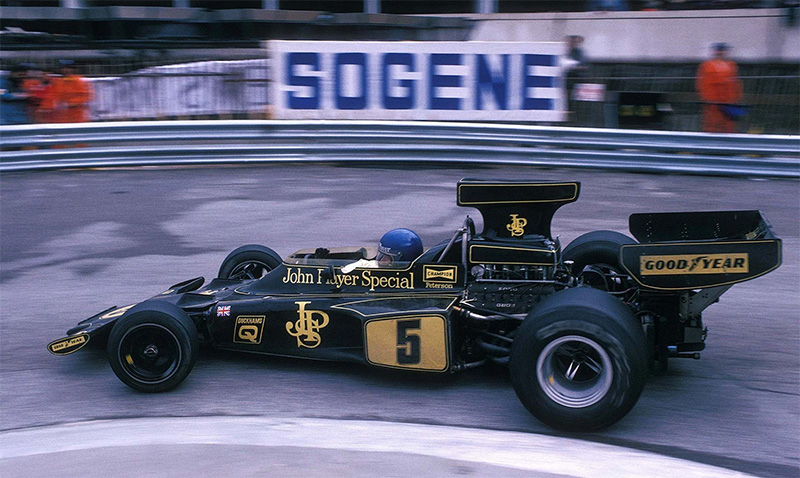

# Lotus F1 - back to glory

## Förutsättningar
Kommer ni ihåg Ronnie Peterson i sin svarta Lotus med John Player Special liveryt i guld? Inte jag heller, men det är sjukt snyggt på bild, fortfarande. Och nu är det dags igen! Teamet ska starta upp än en gång och numer är IT och _flödet_ av data helt centralt för framgången för ett F1 team. Vi har fått uppdraget att designa systemet runt bilen och utvecklingen av det. Hur blir vi snabbare? Varje 1000-dels sekund på banan räknas.

En bil har ca 300 sensorer och flera komponenter som kan styras från depån, likväl som inifrån bilen. En bil genererar ca 1-1,5 miljoner datapunkter under ett lopp. Det finns även en konstant full-hd kamerastream på varje bil, samt strömmande röstkommunikation.

Sensorerna samlar data från t.ex. däcktryck, marktryck och vingarnas position, hastighet, bromsverkan, flöden, temperaturer av olika slag med mera. Saker man kan styra remote från depå är bl.a. vingarnas position, när "boost" är tillgängligt, luft/bränsle-blandning, fjädring, tända lampan för att gå i depå etcetera.

Telemetrin (sensordata) behöver strömma kontinuerligt till depån, och ska finnas tillgängligt både som rådata och AI/ML analyserad data. Datat behöver under race-dag vara i "realtid", vilket betyder att man behöver datat inom någon sekund. Uppstår ett "glapp" i datakommunikationen vill man inte vänta på att spela upp det man missat, utan man vill ha det färskaste datat. Datat överförs trådlöst via WiMax-nätverk som är installerade på banorna, men det måste även gå att tanka ur data snabbt via kabel under depåstopp. Det ska fortfarande synas i samma vyer i depån oavsett hur det laddats dit.
En del av detta data ska även finnas tillgängligt i cockpit hos föraren i realtid, i stort sett direkt från sensorn.

Efter ett lopp ska det även finnas mer detaljerade vyer, samt en komplett sammanställning av allt data, även det som eventuellt missats under loppet, tillsammans med djupare analyser som kanske gjorts eller kommer göras.

"Worst case", då mest händer och mest data flödar, är själva race-dagen och det är den vi fokuserar på att kunna lösa, då löser vi övriga tillfällen också.

Kom även ihåg att datat i stor mån överförs trådlöst, men det är högst privat och företagsspioneri förekommer på olika nivåer. Molntjänster, on-prem, SaaS... alla medel är tillåtna. Robusthet, resiliens och ultra-performance är alla högsta prio.

Gällande video- och röst-strömmar så ska dessa broadcastas, så både tävlingsledning och tv-produktionen kan ta del av dem on-demand.
Telemetridatat ska även kunna delas med tävlingsledningen on-demand för att kunna utreda olika händelser.

Kom ihåg att det måste gå hantera flera bilar; 2 bilar under race, eller 1-4 bilar under test-dagar. En förare kan ha många bilar under en säsong.

Det är F1 vi pratar om här, pengar är ingen trång sektor, det är bara att köra så fett det behövs. Lika fett som bakdäcken på Lotus -75.

## Uppgiften
Eran uppgift blir att _designa_ systemet, hur det _skulle kunna_ byggas upp. Det finns en stor grupp människor runt om som jobbar både specialiserat och generellt i teamet med olika delar, så resurserna är näst intill oändliga bara målet att vinna mästerskapet nås.

OBS! Ingen kod behöver skrivas, en "blueprint" eller någon form av karta som beskriver det hela räcker gott.

## Teamen
Bilda team efter egna preferenser som ni tror att ni behöver er sammansättning. Ni kommer sedan få motivera den sammansättningen och hur den hjälpt er genom processen med allas bakgrund och olika kompetenser.

Ställ/sätt er i teamen och säg till när ni är redo, ni har max 5min att forma teamen.
